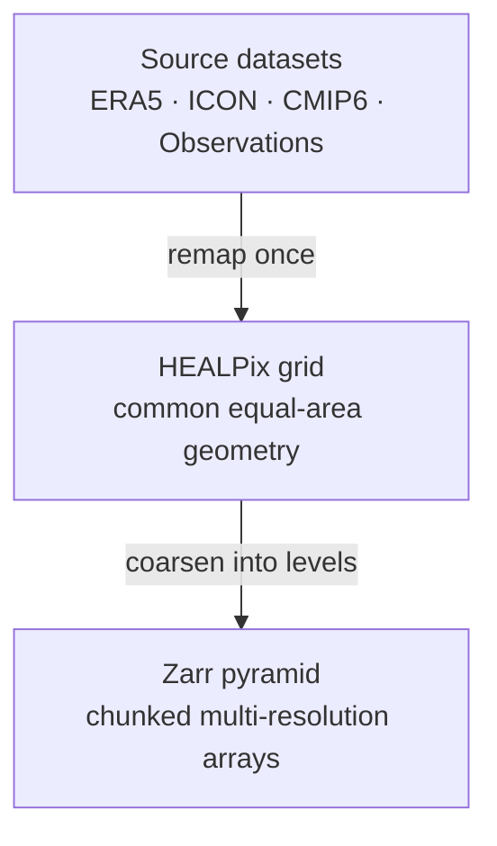

This section explains the key storage and access decisions behind Waterpark.

Waterpark combines three ideas: a common **HEALPix grid**, chunked **Zarr**
datasets, and **S3-compatible object storage**. Together, these choices make
climate and Earth observation data easier to compare, easier to stream,
and easier to use in interactive analysis or machine-learning workflows.

We first explain why Waterpark remaps datasets to HEALPix, a hierarchical
equal-area grid that provides a common geometry across very different source
datasets. We then describe why the data is stored as Zarr pyramids and why
this format works especially well when served from an S3 object store.

