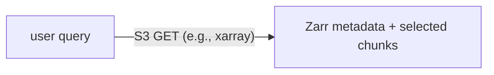

HEALPix solves the common-grid problem. Zarr and S3 solve the access problem.

Waterpark datasets can be large. Users should not need to download whole files
or mount a special filesystem just to inspect a subset of a dataset. They should
be able to open a dataset lazily, select the variables and time range they need,
and let the array library fetch only the relevant chunks.

That is the role of **Zarr** and **S3-compatible object storage**.

---

## Why Zarr?

Zarr stores arrays as compressed chunks plus metadata. Instead of one large
monolithic file, a Zarr store is a directory-like collection of metadata and
chunk objects.

For example, a simplified Zarr store can look like this:

```text
level_7.zarr/
├── .zattrs
├── .zgroup
├── .zmetadata
├── tos/
│   ├── .zarray
│   ├── .zattrs
│   ├── 0.0
│   ├── 0.1
│   └── ...
└── time/
    ├── .zarray
    └── ...
```

This layout is useful because a client can read only the chunks needed for a
specific query.

```python
import xarray as xr

ds = xr.open_zarr("s3://example-bucket/healpix/era5/level_7.zarr")
sst = ds["sst"].sel(time="2020").mean("time")
```

The dataset opens lazily. Metadata is read first; array chunks are loaded later,
only when a computation needs them.

### Why this fits xarray and dask

Many climate scientists already use xarray and dask. Zarr fits that ecosystem
well:

- xarray understands labelled arrays and metadata,
- dask can load chunks lazily and in parallel,
- computations can run on laptops, HPC nodes, or larger distributed systems,
- the storage layout matches chunked array computation.

For Waterpark, this means users can work with familiar tools while avoiding the
old pattern of downloading many source files and manually preparing them.

---

## Why S3-compatible access?

S3-compatible object storage provides an HTTP-based way to access data objects.
Users do not need a mounted filesystem. The same logical dataset can be accessed
from different environments:

- a local notebook,
- a DKRZ service,
- an HPC job,
- a web application,
- a cloud-like compute environment.

This decouples storage from compute. The data location becomes a URL and a set
of access options rather than a filesystem path that only works on one machine.

---

## Why Zarr and S3 work well together

Zarr chunks map naturally to object storage objects. A query that touches only a
small part of an array only needs the metadata and the relevant chunk objects.



This is what makes Waterpark suitable for interactive and programmatic use. A
preview map can use a coarse HEALPix level and fetch relatively few chunks. A
larger analysis can select a finer level and process many chunks in parallel.

## Multi-resolution pyramids

Waterpark stores datasets as pyramids. Each pyramid contains multiple HEALPix
levels:

```text
level_0.zarr
level_1.zarr
level_2.zarr
...
level_N.zarr
```

This structure supports different access patterns:

| Use case | Suitable level |
|---|---|
| Dataset discovery | coarse levels |
| Web previews | coarse to medium levels |
| Exploratory analysis | medium levels |
| Detailed analysis | finest available level |
| Machine-learning pipelines | selected levels, depending on model design |

The key point is that users do not always need the finest data. Coarser levels
are cheaper to open, transfer, and render.

## Current serving model

Waterpark currently exposes data through an S3-compatible gateway. The backend
can change over time: today it may be a gateway in front of an existing
filesystem; later it may be dedicated object storage.

The important design choice is that the public access pattern remains
S3-compatible. Users and applications should not need to care whether the bytes
behind the endpoint currently live on Lustre, object storage, or another storage
tier.

## Hot, cold, and catalogue-aware storage

Not all data can remain hot forever. Large archives often need multiple storage
tiers:

- **hot** data on S3-compatible storage,
- **cold** data on tape or another archive tier,
- metadata and coarse levels kept available for discovery and preview.

A useful catalogue must therefore know not only what a dataset is, but also
where it currently lives. A pyramid may be fully hot, partially hot, archived,
or staged on demand.

One possible policy is:

```text
metadata + coarse levels  -> always hot
popular fine levels       -> hot
rarely used fine levels   -> cold / recallable
```

That keeps discovery responsive while allowing the expensive storage tier to be
managed more carefully.

## Why this is analysis-ready

The combination of HEALPix, Zarr, and S3 turns many datasets into a more uniform
analysis layer:

- one geometry,
- one chunked access model,
- one URL-based access pattern,
- multiple resolutions,
- fewer per-user preprocessing steps.

That is why Waterpark can be described as analysis-ready and cloud-optimized:
the work of grid conversion and storage layout is done once, centrally, instead
of being repeated by every user.
